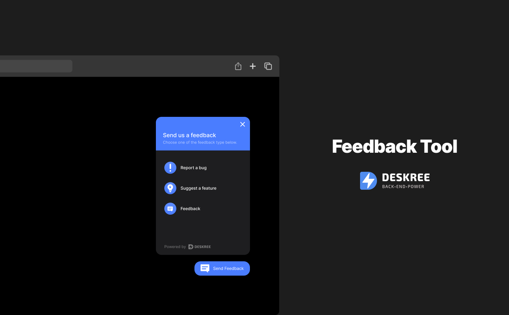
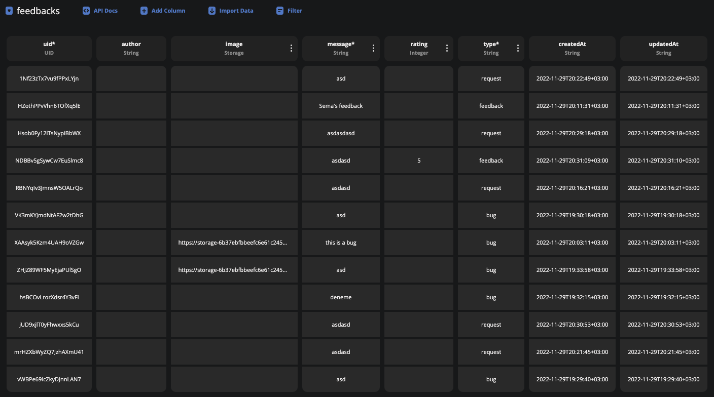
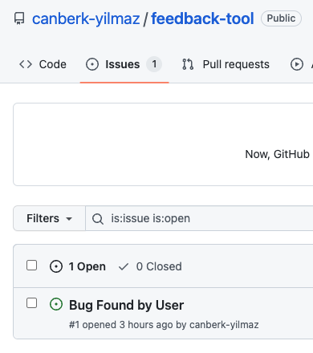

<h1 align="center">#Feedback Tool</h1>

 

  

<h1 align="center">Deskree DB Preview</h1>
  

## ✨ Technologies

This project was made by using:

- [Vue](https://vuejs.org/)
- [Nuxt.js](https://nuxtjs.org/)
- [TypeScript](https://www.typescriptlang.org/)

## 💻 Project

Feedback tool is an app built using Nuxt 3 to make easier for your users to send you feedback.

## 💻 What this project does

This tool helps users to give feedback and their feedback directly opens issue in github. You can try to give feedback and check in the issues.

<h1 align="center">Github Preview</h1>
  

## 💻 How project works

After integrating your github account to deskree account you can send queries to work with deskree.

## 🚀 How to run it

- Fork the repository
- Install the dependecies with `npm i`
- Create the .env file with the right variables
- Start the server `npm run dev`

You can access using [`localhost:3000`](http://localhost:3000) on your browser.

## 📄 License

This project is under MIT license.

---
